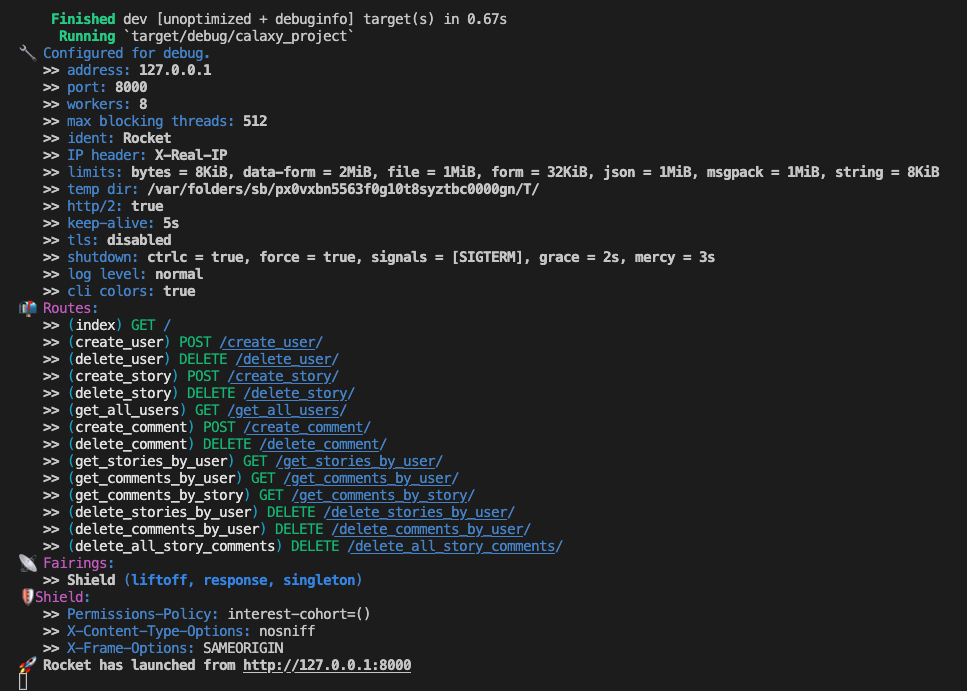
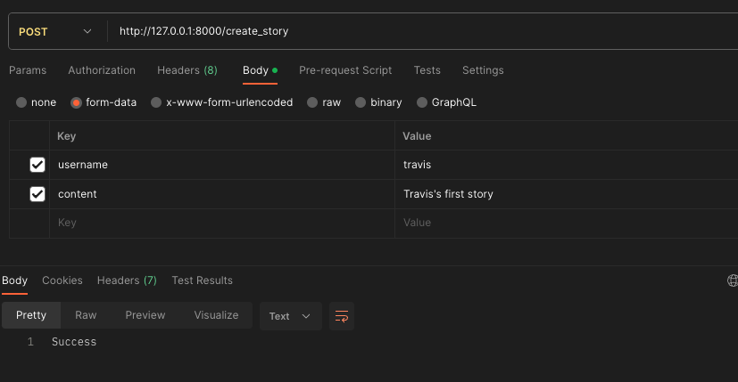

# Calaxy_Project
Take home project for Calaxy interview

This is a simple, text based social network accessed and used via api calls. Below you will find a list of endpoints you can access as well as descriptions / paramaters for each. I will also provide information on running this locally. The final section is a list of future improvements I would make given more time. 

# Overview
This backend was built using rust's Rocket crate, as well as sqlx for database interactions. This particular solution is built to work with a postgres database, and for ease of use I will provide instructions on how to locally spin up a postgres server using docker for data persistence. There is also a version of this system running in the cloud (AWS) and the address for this server can be provided upon request.

# Running Locally
This section assumes you already have rust and docker installed.

### Installing sqlx cli Tools
To create the tables inside of the postgres server, you will need the sqlx cli tools installed. Run the following:
`cargo install sqlx-cli`

### Starting Postgres Server
Run the following command to download and install a boilerplate postgres server. Leave the paramaters as they are because these specific values are referenced in the backend.
`docker run -p 5432:5432 --name some-postgres -e POSTGRES_PASSWORD=mysecretpassword -d postgres`
Of course if you wanted this to be more secure you would change these values to a more secure version, but for ease of example use they have been kept simple.

### Creating Postgres Tables
The following command utilizes the sqlx script in the migrations folder to create the tables needed to support our social network.
`sqlx migrate run`
You should see a message of success.

### Running the API
This version of code has several components that require the nightly build of rust. You can either do this:
`rustup override set nightly`
`cargo build`
`cargo run`
Or this:
`cargo +nightly build`
`cargo run`

Once the the server spins up, you should see a message like this:

# Endpoints

All endpoints that accept data (including GET requests) accept data as multipart form data. Here is an example how to do this in Postman:

You can also make any of these requests using curl, but I find postman to be more organized and easier to use / test with.

To send a request to any endpoint, make sure the url is http://<ip-address>:8000/<endpoint>. If you are running this locally, the ip-address will be `127.0.0.1`.

All endpoints that return data return it in json format.

### USER Endpoints

GET
`/get_all_users`

Params:
None

POST
`/create_user`

Params:
- username : String
- password : String

DELETE
`/delete_user`

Params:
- username : String

### STORY Endpoints

GET
`/get_stories_by_user`

Params:
- username : String

POST
`/create_story`

Params:
- username : String
- content : String

DELETE
`/delete_story`

Params:
- story_id : i32

DELETE
`/delete_stories_by_user`

Params:
- username : String

### COMMENT Endpoints

GET
`/get_comments_by_user`

Params:
- username : String

GET
`/get_comments_by_story`

Params:
- story_id : i32

POST
`/create_comment`

Params:
- username : String
- story_id : i32
- content : String

DELETE
`/delete_comment`

Params:
- comment_id : i32

DELETE
`/delete_all_story_comments`

Params:
- story_id : i32

DELETE
`/delete_comments_by_user`

Params:
- username : String

# Future Improvements
There are several improvements that I would add given more time and actual use case need:
- Authentication
    This system does not provide any login to authenticate users so clearly this is not a real world application as every user can interact with / manipulate ever other user's data.
- Better CICD
    This repo uses github actions to build the application and deploy to an AWS EC2 server. I ran into a small problem on dockerhub authentication in the last step of the gh action, as well as running the nightly build in the docker environment. I wasted allot of time trying to fix these issues, and if this was an actual application I would fix them.
- Better Containerization

    As stated in the previous improvement, I had an issue running the nightly build of rust in the Docker container. Earlier versions of the application were successfully run inside of docker, but newer dependencies broke the docker build. Given more time I would fix this issue for easier local running as well as CICD. I would also bundle the postgress server into the same docker container or use docker-compose to spin up both environments for ease of use.
- A Frontend

    Clearly this type of application is extrememly limited in its user base potential by requiring interaction via api requests. Given more time I would build a frontend to sit atop the application.

- Scaling Solutions

    Given the assumption that this application would scale to millions of users, I would use the containerized solution within a kubernetes cluster to better handle traffic, and create load balancers in the cloud.

- Better Error Handling

    Currently bad requests don't return very useful information on what went wrong, and given more time I would institute better request responses to give more verbose errors. The current server wont crash given a bad request, but will just return a 500 internal server error instead of useful information.

- SQL/Malicious Code Injection Protection

    Handling of malicious code injection would be important in a real application.
